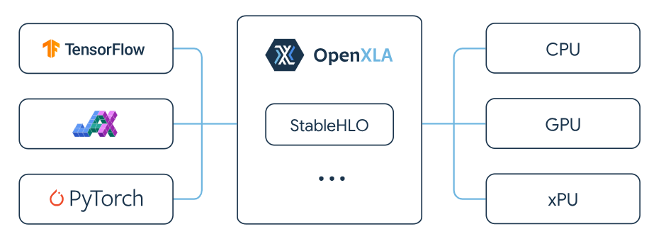

# StableHLO tutorial
这个仓库重点参考[StableHLO官方文档](https://openxla.org/stablehlo)
## General Picture
  
对于大模型开发者，支持`JAX`，`Pytorch`和`Tensorflow`三种框架，对于mlc开发者，`StableHLO`支持将`pytorch`等高层机器学习框架的计算图表示转变成算子dailect，然后逐层转到`linalg on tensor`。详情见[StableHLO Specification](https://openxla.org/stablehlo/spec)：
```shell
StableHLO is an operation set for high-level operations (HLO) in machine learning (ML) models. StableHLO works as a portability layer between different ML frameworks and ML compilers: ML frameworks that produce StableHLO programs are compatible with ML compilers that consume StableHLO programs.
```

> `StableHLO` 可以作为XLA和IREE项目的输入。

## Tools
`StableHLO`作为机器学习框架和mlir编译流程的统一中间表示，工具大体可以分成三类：  
* JAX-to-StableHLO等接入工具
* StableHLO内部优化passes，以及dialect描述机器学习workload
* StableHLO-to-TOSA和StableHLO-to-Linalg接入mlir社区  

`StableHLO-to-Linalg`这块流程，可以参考[mhlo-to-linalg talks for iree](https://mlir.llvm.org/OpenMeetings/2021-10-07-The-Torch-MLIR-project.pdf)。

## Related Project
1. [OpenXLA](https://openxla.org/stablehlo/awesome)
2. [IREE](https://github.com/iree-org/iree)
3. [XLA operation talks](https://zhuanlan.zhihu.com/p/396309457)


